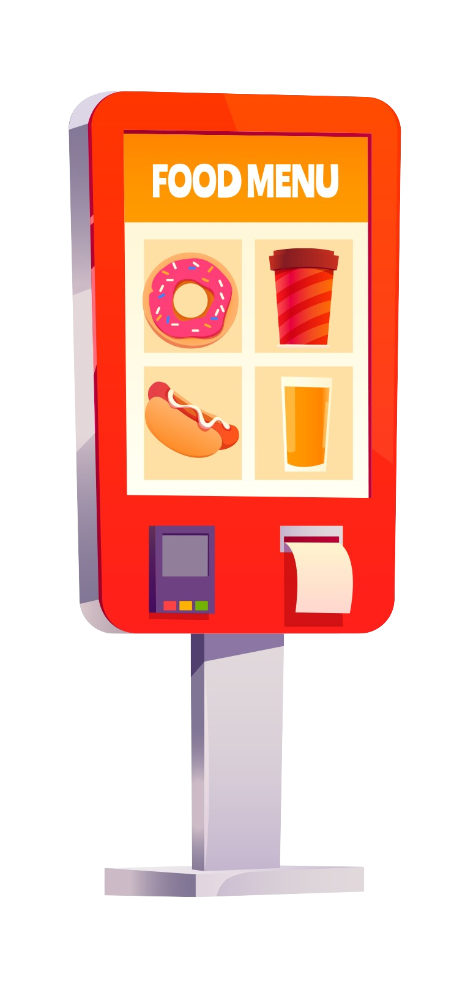

# Totem de Autoatención en Cafetería 
## DEPRECADO
- Deprecado debido a bug que impide silent-print por ende el software pierde una característica necesaria para el correcto funcionamiento del software
- Se usa en reemplazo Firefox --kiosk

Este proyecto es una aplicación de autoatención para una cafetería, desarrollada con ElectronJS. Permite a los clientes realizar sus pedidos y pagar de forma autónoma utilizando un terminal con pantalla táctil.

## Características

- La aplicación utiliza un WebView de ElectronJS para mostrar una página web que proporciona la interfaz de usuario para los clientes.
- La página web consumida muestra el menú, opciones de personalización y permite a los clientes realizar pedidos.
- La aplicación se ejecuta en modo de pantalla completa, brindando una experiencia optimizada para pantallas táctiles.
- La aplicación solicita un número de caja único a un backend utilizando la dirección MAC del dispositivo.
- Si la dirección MAC no está registrada, la aplicación se registra automáticamente enviando una solicitud HTTP al backend y obtiene un número de caja asignado.
- El número de caja asignado se envía a la página web a través del WebView para que se pueda registrar en las boletas de compra.
- La aplicación está diseñada para ser intuitiva y de fácil uso para los clientes de la cafetería.

## Requisitos del sistema

- Node.js (versión 18.16.0)
- NPM (versión 9.5.1)

## Instalación

1. Clona este repositorio en tu máquina local:
- <code>git clone https://github.com/keaguirre/CafeTotem</code>
2. cd CafeTotem 

3. Instala las dependencias del proyecto:
- <code>npm install</code>
4. Inicializa el proyecto
- <code>npm start</code>

## Ejecución

1. Ejecuta la aplicacion con <code> npm start </code>

2. La aplicación se abrirá en modo ventana (800x600) y cargará la página web desarrollo.

3. Atentos a los log en la consola(durante el desarrollo mostrarán información de su ejecución).

<!-- 3. Sigue las instrucciones en la página web para realizar pedidos y realizar el pago. -->

## Licencia

Este proyecto está bajo la Licencia MIT. Puedes consultar el archivo `LICENSE` para más detalles.

---
¡Gracias por utilizar nuestra aplicación de autoatención en una cafetería con ElectronJS! Esperamos que sea de gran utilidad para tu negocio. Si tienes alguna pregunta o consulta, no dudes en contactarnos.

